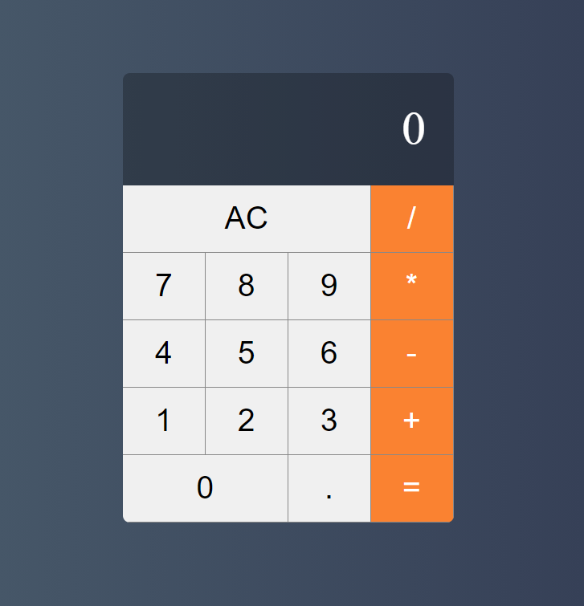

# A simple React Calculator

- This project was made with the aim of practicing react.

# Design

- This calculator had your design inspired of the mac calculator.

  

### `yarn start`

Runs the app in the development mode.\
Open [http://localhost:3000](http://localhost:3000) to view it in the browser.

The page will reload if you make edits.\
You will also see any lint errors in the console.